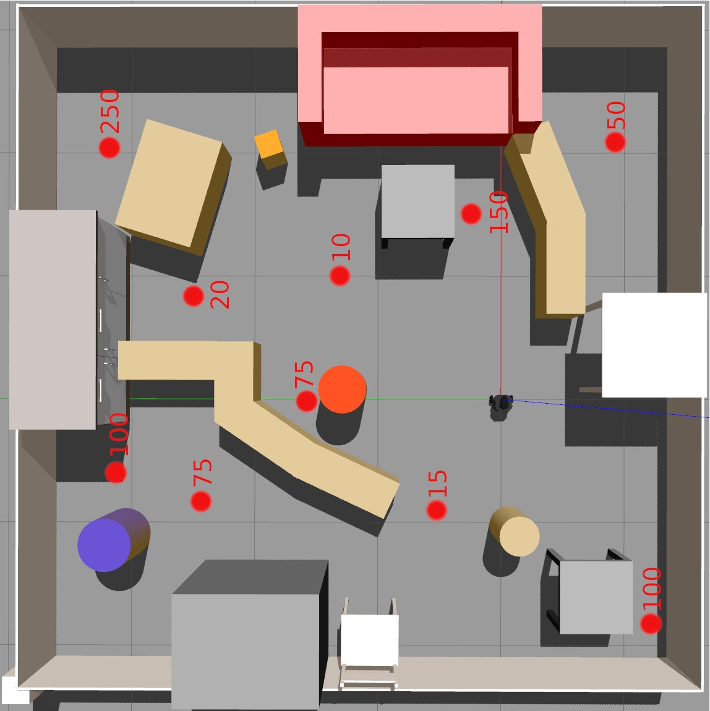
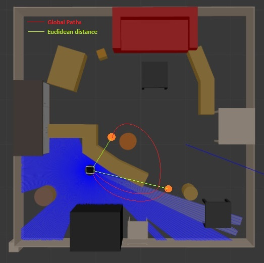
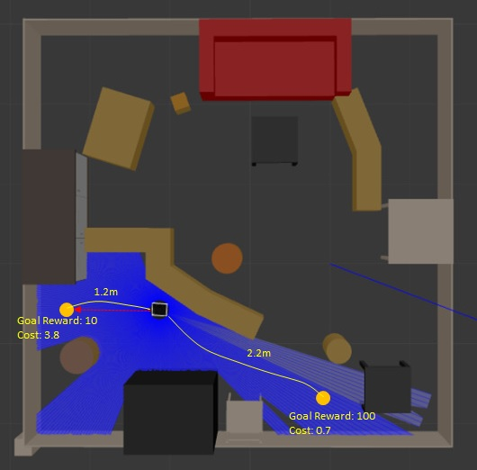
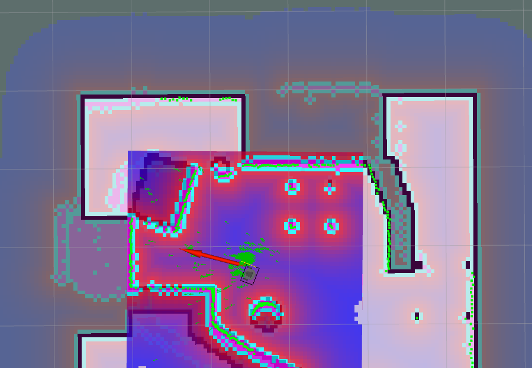
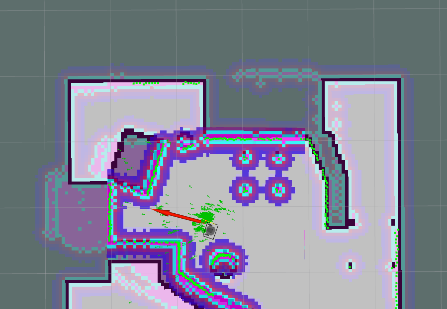
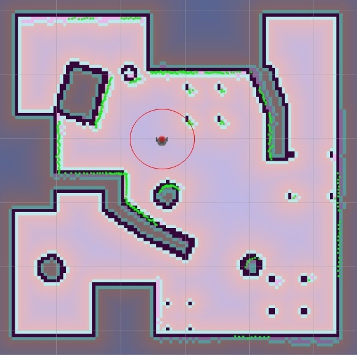
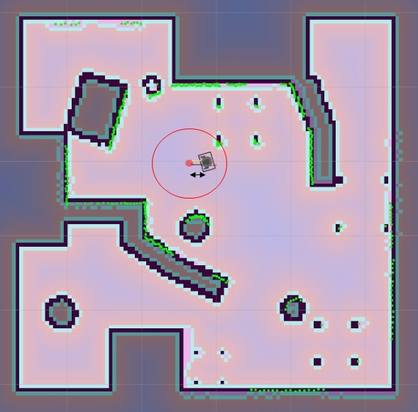
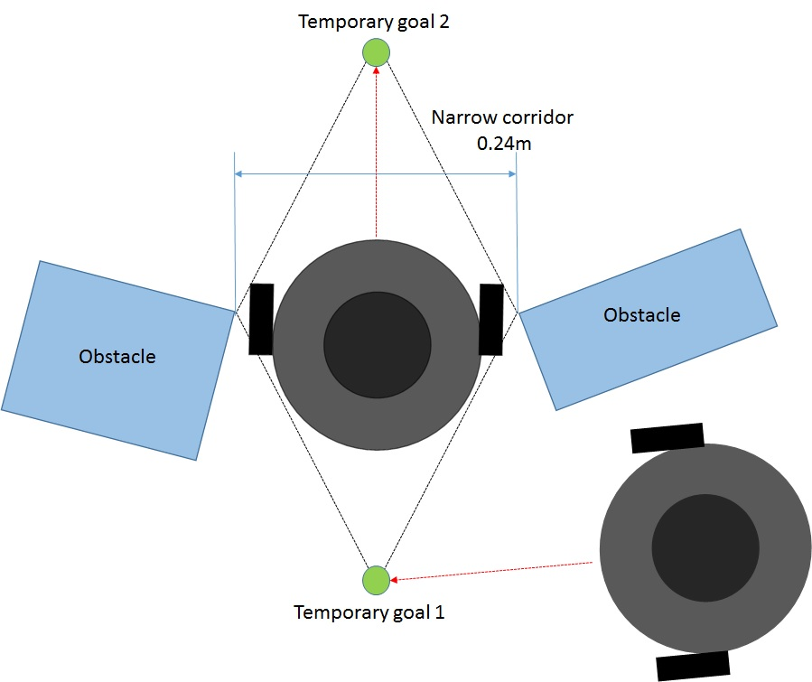

## Team details

Team name : **JIMAKI**

Name| Matr.No.| Address|
:--- | :---| :---|
JIBIN THOMAS MATHEW| 32945| @jt-192120|
KISHORE GOVINDA REDDY| 32917| @kg-192092|
MANJUNATH KRISTAPPA BADAMI|33053|@mb-192233|

## Objective

With a given practice map `model2.sdf` we have to reach the goals which are published by `goal_publisher` package. Each goal will be having its own reward points. The aim is to collect as many reward as possible in ten minutes avoiding the obsticals using `move_base` package.

The training arena looks like

## Short Description

As the aim is to collect the maximum reward points we came up with sorting algorithm which is based on the cost function wihch is dependent on global path distance and rewards. We subscribed to amcl and move_base nodes to navigate through the world. AMCL (adaptive Monte Carlo localization)  takes in a laser-based map, laser scans, and transform messages, and outputs pose estimates. The move base node links together a global and local planner to accomplish its global navigation task. In this project we used default global and local planners i.e Navfn as base global planner and DWA (Dynamic Window Approach) planner as base local planner. We also implemented the logic to switch to manual drive where movebase is not able to navigate.

## Sorting algorithm

- Subscribing to the `/goals` topic and storing all the goals and its respective rewards in seperate list.
- Planning the global path from the bots current position to all the goal points using `move_base/NavfnROS/make_plan` service.
- Calculating the distance to all the goal points using this global path and storing these values in list.
- Normalize both rewards and distances list.
- Calculating the cost value by dividing normalized distance by normalized reward for each goal points and store them in separate list.
- Make the list of tuple (goal point, distance and cost value).
- Sort the list by using the cost value.
- Select the goal point with low cost value and check if the distance is less than two meters (goal point in vicinity).
- If yes, then select the goal point as next goal.
- If not, check for the goal whose distance is less that two meters and select that goal as next goal.

At first we tried sorting goals with euclidian distance but we faced some problems in this sorting algorithm. The problem arises when the goal point is on the other side of the obstacle. By calculating euclidean distance we get goal point A as nearest goal by actually goal point B is nearest goal if we consider the global path.

Before going next goal point which has low cost value we check for the goals in the visinity (threshold taken as two meters). If there are any goal points then change move towards that goal point.

## Global and Local Planners

### Global Planners
We tried different global planners like `carrot_planner`, `sbpl_lattice_planner` and `navfn_planner`. We tweaked some of the parameters and checked whether it will sute for our project. We finally came to conclusion that default glabal planner i.e Navfn Global planner is best for our project. The Carrot planner allows the robot to get as close to a user-specified goal point as possible. It can be used in situation where the goals are present on the obstacle.

### Local Planners
We came across `teb_Local_planner` (Timed Elastic Band) and `dwa_local_planner`(Dynamic Window Approach). Afer testing and changing some of the parameters using ROS dynamic reconfigure finally we selected dwa local planner for our project. 

## Selecting the parameters

When trying to reach goal point with reward 250, we had to go through narrow path which is almost equal to the diameter of turtlebot3. We tried reaching the goal point using different `cost scaling factor (CSF)` and `inflation radius (IR)` values. Some of which are displayed in below images.

Default values (CSF=3, IR=1)|Reconfigured values (CSF=6, IR=0.5)
:-------------------------:|:-------------------------:
 |

Change the xy goal tolerance to 0.25 and yaw goal tolerance to 3.13 so that it will be helpful for us to reach the goal if there is another bot is already presentat the same goal.

|Default values (xy tolerance=0.05, yaw tolerance=0.17)|Reconfigured values (xy tolerance=0.25, yaw tolerance=3.13)|
|:-------------------------:|:-------------------------:|
| ||

## Implementation of manual driving mode

- Manual driving mode helps the bot pass through narrow corridors. 
- Find the indices of laser scan at which the start and the end of the narrow path opening occurs by using goal cordinates and coordinate of a point in the global plan.
- Calculating midpoint and the angle to this point using the starting and ending laser index with respect to the narrow corridor.
- After calculating midpoint of the narrow space calculate the intermediate goals the bot should reach inorder to pass through the narrow corridor.
- Moves the bot through the intermediate goals at a steady speed of 0.05 m/s.
- Finally after crossing the narrow path switch to the move_base to reach the required goal.

 

